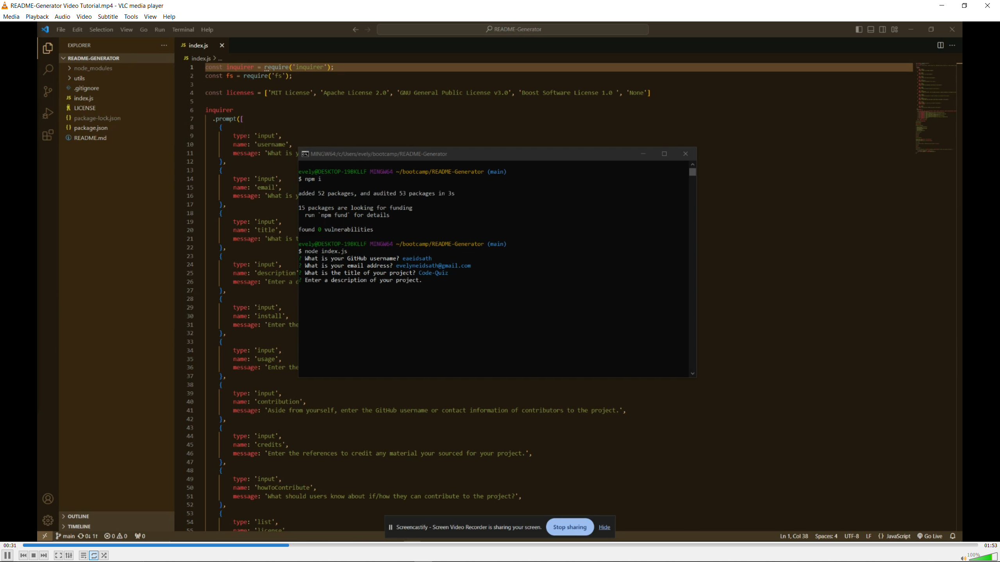
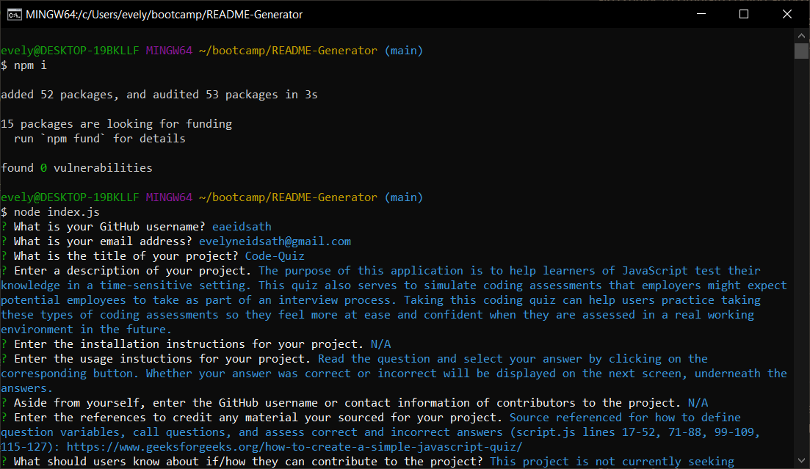

# README-Generator

## Description
    
This project generates a professional README based on user input. Using NodeJS, users can open the application in their terminal and use the command line to start the generator and answer prompts to easily create a thorough README for their own projects.

When creating applications and software online, it is important to have a professional README to properly explain how your project functions, what resources were used, who has contributed in the past, and how new users can contribute in the future. Having a thorough README is key to a professional and coherent online porfolio.

This application is my first code created for use with NodeJS and the terminal, rather than browser-based applications. Creating this application helped me become more familiar with terminal-based software as well as the utility of the Inquirer package.
    
## Table of Contents
    
- [Installation](#installation)
- [Usage](#usage)
- [Screenshots](#screenshots)
- [Contributing](#contributing)
- [License](#license)
- [Tests](#tests)
- [Questions](#questions)
    
## Installation
    
Install the latest version of NodeJS from their website. You will need the Inquirer package to run this program. To install this, navigate to the folder containing this project and run the following command: npm i. The package.json file included in this repo already contains inquirer under the dependencies, but you can specify a different version of inquirer if needed using the command: npm i inquirer@"version number here". Once that is installed, you can start the generator by running the command: node index.js.
    
## Usage
    
Once you have started the generator with the node index.js command, answer the prompts as they appear in your terminal. Hit enter to proceed to the next question and navigating with your arrow keys when selecting an answer from a list. After the final question has been answered and a "Success!" has been logged in your terminal, check for a file titled "newREADME.md" to find your newly generated README file.

### Screenshots

Click the following image to see the video tutorial on installing inquirer and using the generator:

Here is a screenshot example of what your terminal should look like after installing the necessary package and filling out the generator's prompts:

    
## Contributing

- Contributors: [eaeidsath](github.com/eaeidsath), [Xandromus](github.com/Xandromus), [gachoi06](github.com/gachi06)
- Credits: N/A
- Contribution instructions: This project is not looking for contribution at this time.
    
## License

The following license is being used for this project: MIT License.
    
## Tests

N/A

## Questions

Please direct questions to [eaeidsath](github.com/eaeidsath) or email your questions to evelyneidsath@gmail.com.